# SalesHealth · Proyecto Final — Gestión de Datos

Construcción de un entorno analítico de extremo a extremo sobre un dataset sintético del sector salud / bienestar: **5 750 clientes**, **50 productos**, **20 tiendas** y **~42 500 ventas** + **2 330 devoluciones**. El proyecto va desde la base de datos cruda hasta un dashboard interactivo, pasando por el data warehouse, el cálculo del CLTV y la segmentación por clustering.

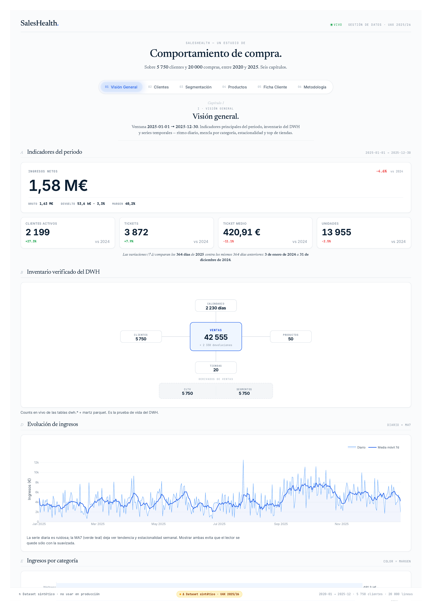

## Lo que hace

1. **Modelo Entidad–Relación** y **modelo dimensional** (esquema estrella).
2. **ETL** desde datos crudos (`public`) hasta el DWH (`dwh`), pasando por un área de `staging`.
3. **CLTV** por cliente, calculado como:
   `CLTV = Ingresos_t × Margen_t × Frecuencia_t × Retención_t`
   junto con **Recencia**, **Tasa de retención**, **AOV** y **Tasa de devolución**.
4. **PCA(2) + KMeans(k=3)** sobre 8 features estandarizadas para segmentar la base de clientes.
5. **Dashboard editorial** en HTML estático + backend Flask para la ficha de cliente, simulador de cluster y filtros sobre el DWH en vivo.

## Modelo de datos

Esquema estrella con dos hechos (`fact_sales`, `fact_returns`) y cuatro dimensiones conformadas:

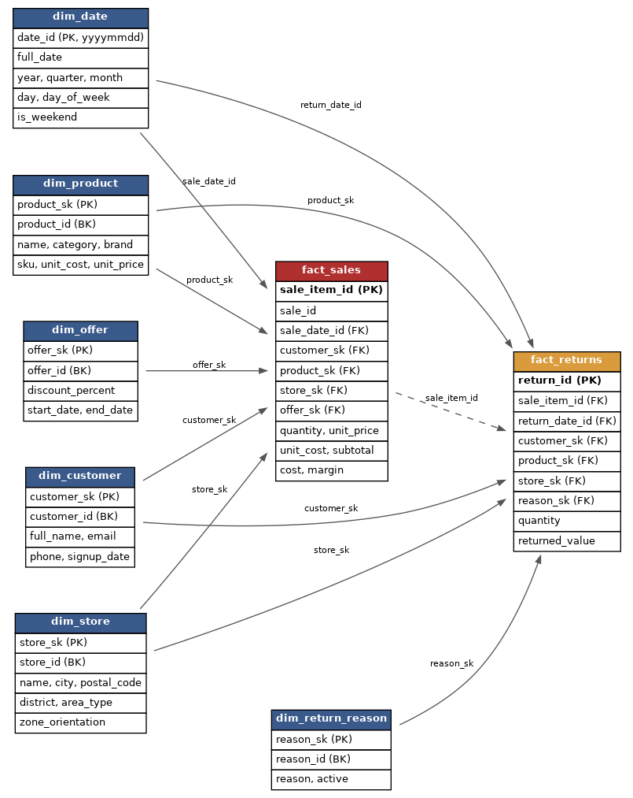

El diagrama Entidad–Relación de partida vive en `docs/er_diagram.md` y se renderiza así:

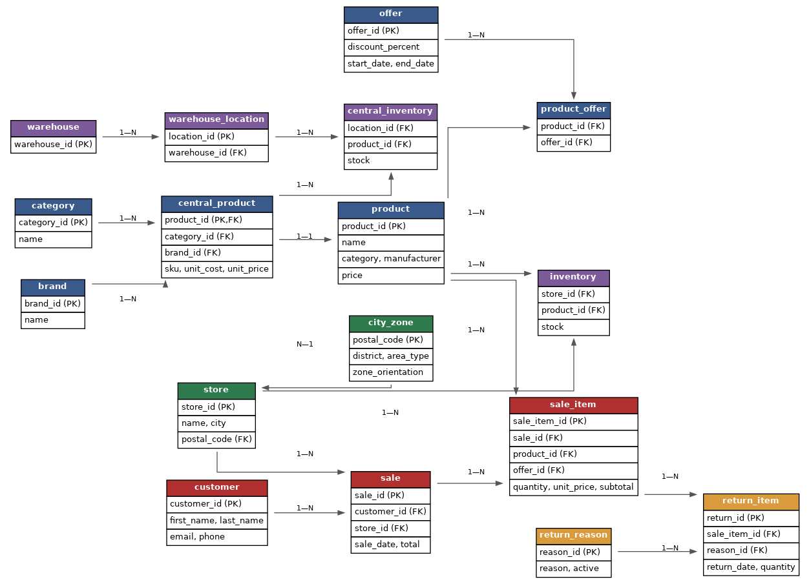

## CLTV y segmentación

Distribución del CLTV en escala log — la asimetría justifica el uso de la mediana como medida central:

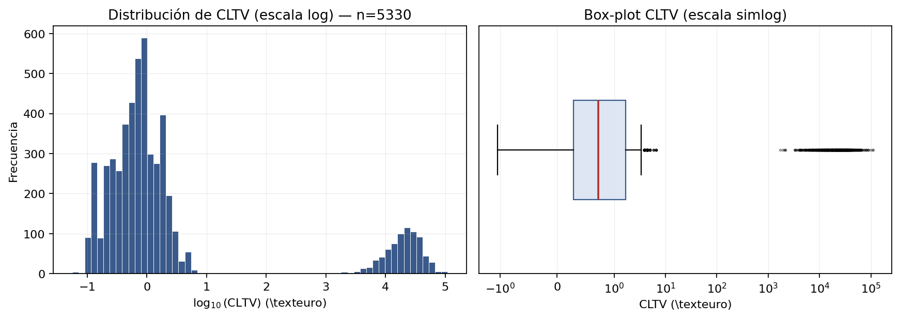

La elección de k se defiende con la curva del codo, silhouette y Davies–Bouldin:

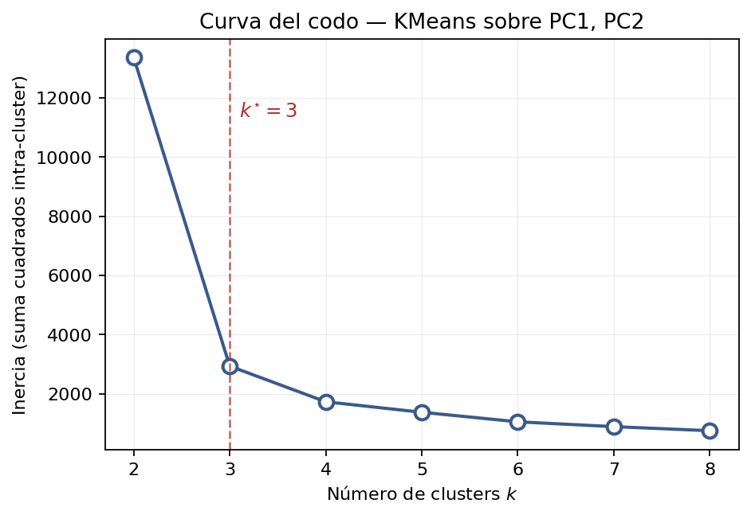

PCA(2) reduce las 8 features a un plano interpretable (PC1 ≈ valor, PC2 ≈ fricción):

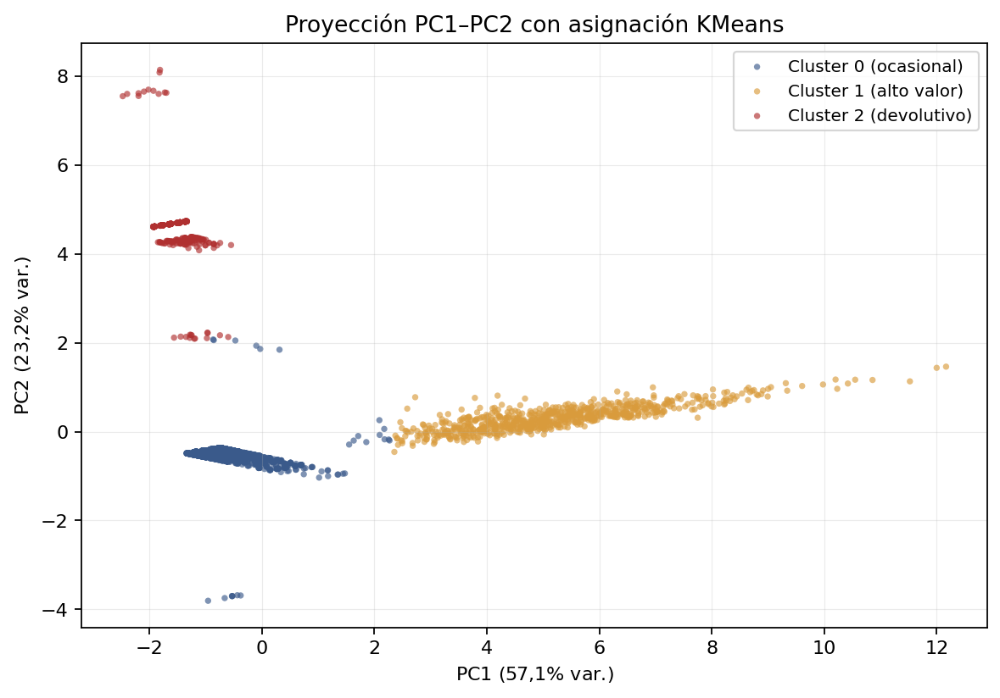

## Dashboard

Seis capítulos navegables, cada uno etiquetado contra las 4 analíticas clásicas (descriptiva / diagnóstica / predictiva / prescriptiva).

| Capítulo | Captura |
|---|---|
| **I · Visión General** — KPIs del periodo + series del DWH |  |
| **II · Clientes y CLTV** — Histograma log, ECDF, Lorenz, Pareto explícito | 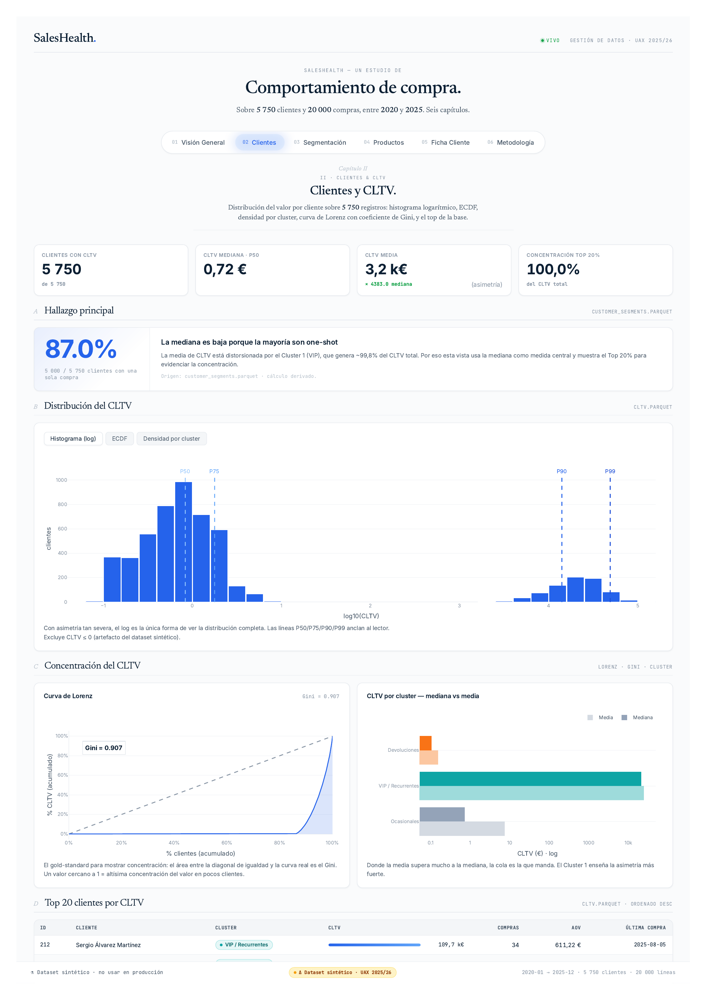 |
| **III · Segmentación** — PCA scatter, cargas factoriales, simulador de cluster | 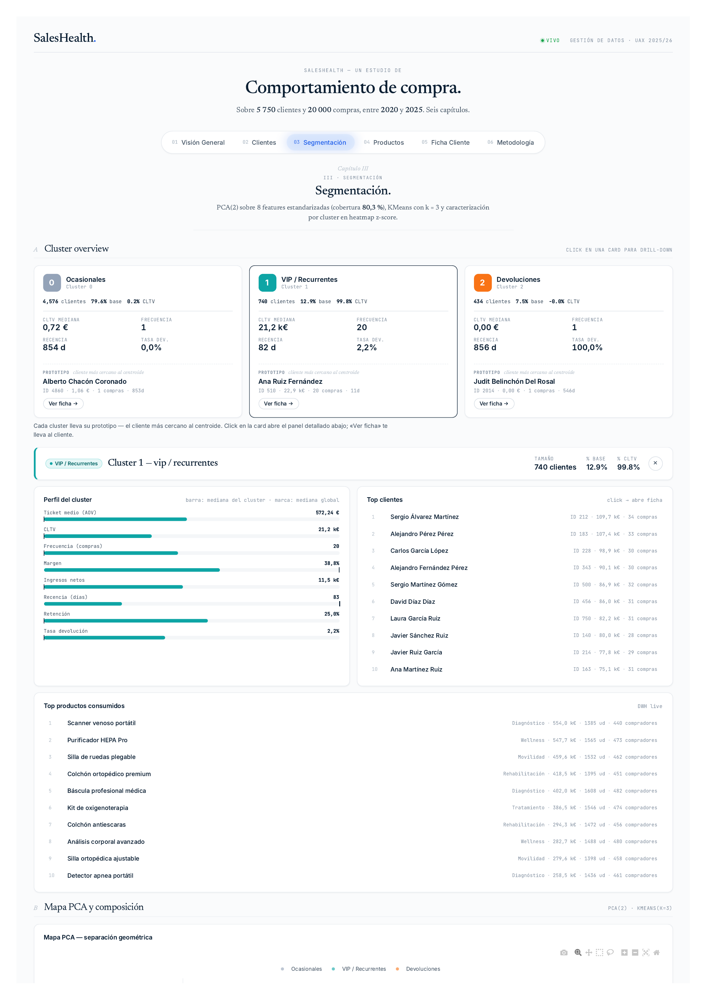 |
| **IV · Productos** — Top SKUs, motivos de devolución, ratio devolución/venta | 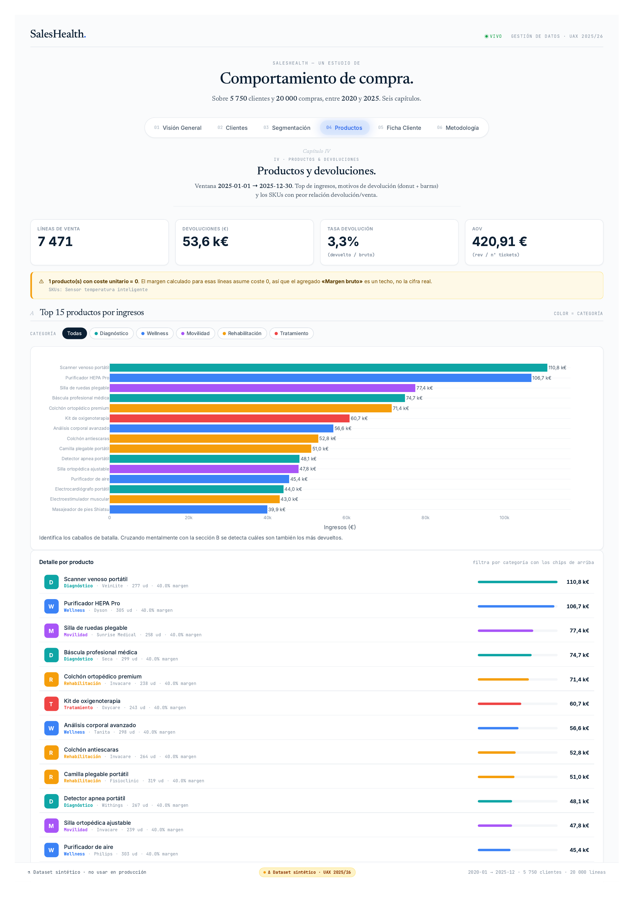 |
| **V · Ficha de cliente** — Búsqueda en vivo, radar, perfil RFM extendido, timeline | 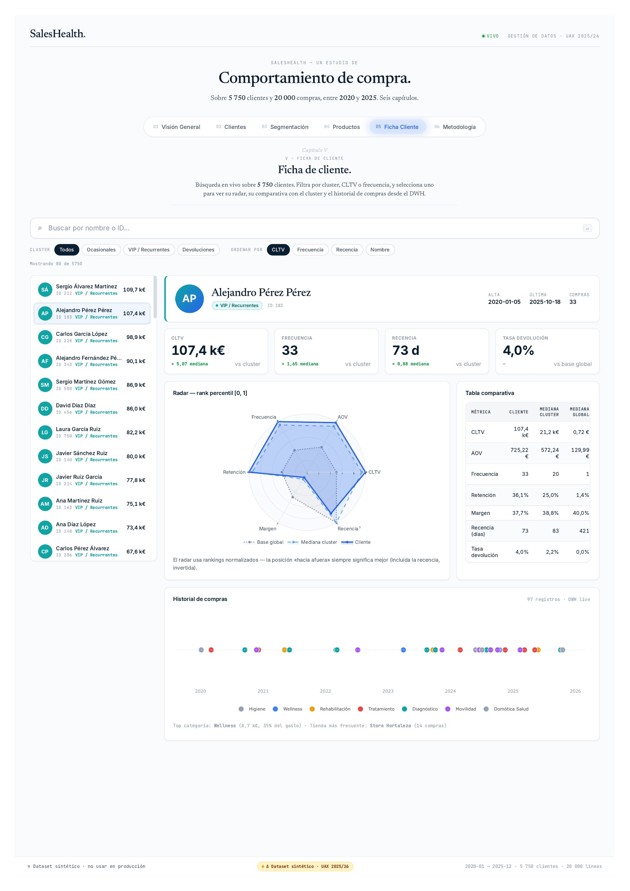 |
| **VI · Metodología** — Trazabilidad KPI → SQL, 5 C del dato, regla de Kaiser | 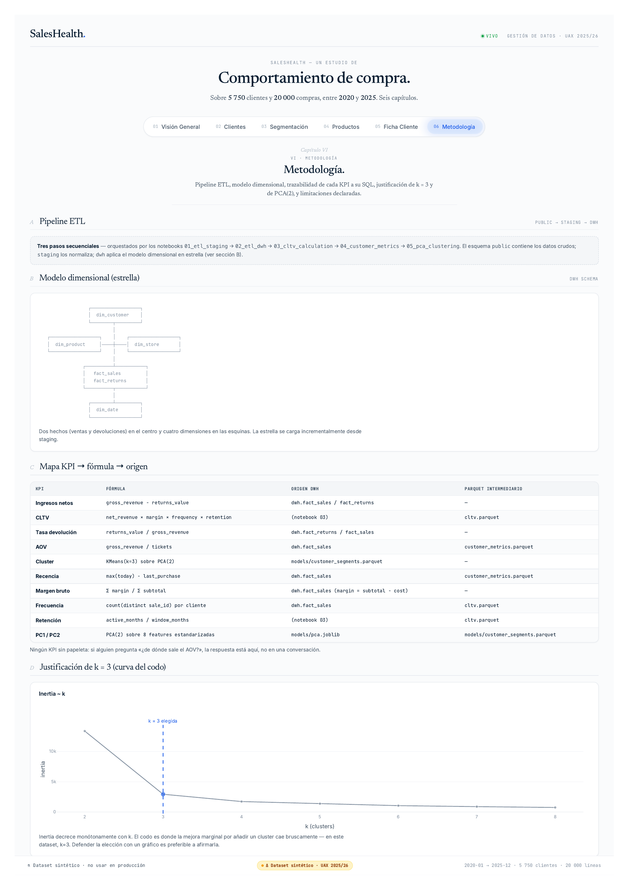 |

## Arquitectura técnica

- **Lenguaje**: Python 3.11+ (entorno conda `UAX`)
- **Base de datos**: PostgreSQL en Docker, `localhost:5433`, BD `saleshealth`
- **Tres esquemas en la misma BD**:
  - `public` — datos crudos (raw)
  - `staging` — datos limpios y normalizados
  - `dwh` — modelo estrella (`dim_*`, `fact_*`)
- **Orquestación ETL**: notebooks Jupyter numerados
- **Dashboard**: HTML estático generado por `dashboard/html/build.py` + backend Flask (`server.py`) para endpoints en vivo (ficha de cliente, simulador, filtros)
- **Configuración**: `python-dotenv` con `.env`

## Requisitos previos

- Conda / Miniconda con un entorno llamado `UAX` (Python 3.11+).
- Docker con PostgreSQL escuchando en `localhost:5433`, BD `saleshealth` creada y tablas crudas en el esquema `public`.

## Setup

```bash
# 1. Situarse en la carpeta del proyecto
cd Proyecto-Final

# 2. Crear el entorno conda (si no existe)
conda create -n UAX python=3.11
conda activate UAX

# 3. Instalar dependencias
conda run -n UAX pip install -r requirements.txt

# 4. Configurar variables de entorno
cp .env.example .env
#  → editar .env y rellenar DB_USER y DB_PASSWORD
```

Todos los comandos Python del proyecto se invocan con `conda run -n UAX ...`.

## Ejecución del pipeline

Los notebooks están numerados y deben ejecutarse en orden:

| # | Notebook | Propósito |
|---|----------|-----------|
| 00 | `00_exploration.ipynb` | Exploración del dataset crudo en `public` |
| 01 | `01_etl_staging.ipynb` | Limpieza y carga `public → staging` |
| 02 | `02_etl_dwh.ipynb` | Carga `staging → dwh` (dimensiones y hechos) |
| 03 | `03_cltv_calculation.ipynb` | Cálculo del CLTV por cliente → `data/processed/cltv.parquet` |
| 04 | `04_customer_metrics.ipynb` | Recencia, retención, AOV → `data/processed/customer_metrics.parquet` |
| 05 | `05_pca_clustering.ipynb` | PCA + KMeans → `models/customer_segments.parquet` + joblibs |

Para abrirlos:

```bash
conda run -n UAX jupyter notebook
```

## Lanzar el dashboard

Una vez generados los parquets y los `joblib` del modelo:

```bash
# Atajo: build + open + Flask en localhost:8001
./dev.sh
```

O paso a paso:

```bash
# Re-generar el HTML estático (lee parquets + joblibs)
conda run -n UAX python -m dashboard.html.build

# Levantar el backend Flask (API + servir el HTML)
conda run -n UAX python -m dashboard.html.server
```

El dashboard se sirve en `http://localhost:8001`. Cuando Postgres no está accesible, las vistas se degradan a un modo "offline" que sigue funcionando con los parquets.

## Tests y lint

```bash
# Tests (los DB-dependientes auto-skipean si Postgres no responde)
conda run -n UAX pytest tests/

# Un solo test
conda run -n UAX pytest tests/test_cltv.py::test_cltv_formula_consistency

# Lint con ruff (line-length=100, target py311)
conda run -n UAX ruff check .
```

## Estructura del proyecto

```
Proyecto-Final/
├── config/                  # Singleton Settings cargado desde .env
├── sql/
│   ├── 02_dwh_schema/       # DDL: CREATE SCHEMA + dim_* + fact_*
│   └── 03_transformations/  # Transformaciones staging → dwh (numeradas 10_, 20_, ...)
├── notebooks/               # 6 notebooks numerados (orquestan el pipeline)
├── src/                     # Código reutilizable
│   ├── db/                  # Engine singleton + helpers SQL
│   ├── etl/                 # Cargas de directorios SQL
│   ├── analytics/           # CLTV, métricas, clustering
│   └── utils/               # Logger y utilidades
├── dashboard/
│   └── html/                # Dashboard editorial (build + Flask + views)
│       ├── build.py         # Genera index.html a partir de parquets + DWH
│       ├── server.py        # Flask: API ficha + simulador + serve estático
│       ├── views/           # Una vista por capítulo
│       ├── theme.py         # Paleta + plantilla Plotly
│       └── style.css        # CSS editorial
├── data/                    # Datos locales (raw / processed) — ignorados por git
├── models/                  # joblibs del PCA / scaler / KMeans + customer_segments.parquet
├── docs/
│   ├── er_diagram.md        # Diagrama ER en Mermaid
│   ├── dimensional_diagram.md
│   ├── Dashboard.md         # Decisiones de diseño del dashboard
│   ├── INFORME.md           # Borrador del informe en Markdown
│   └── report/              # Informe LaTeX completo + Images/
└── tests/                   # pytest
```

## Decisiones documentadas

- **Esquema estrella, no copo de nieve** — dos hechos (ventas + devoluciones) cubren el ciclo de vida del cliente sin normalizar las dimensiones más allá de lo necesario.
- **CLTV con ventana fija de 72 meses** — denominador rígido para `retention_rate`; los clientes nuevos quedan castigados, documentado como limitación en la vista VI.
- **PCA(2)** cubre ~80 % de la varianza y los dos primeros autovalores pasan la regla de Kaiser (λ ≥ 1) — la elección de 2 componentes se evalúa contra ambos criterios.
- **k = 3** se defiende con curva del codo, silhouette máxima y Davies–Bouldin mínima — las tres métricas coinciden y los 3 segmentos resultantes son accionables.
- **Dataset 100 % sintético** — los hallazgos son consistentes pero no transferibles a operación real; declarado explícitamente en el footer del dashboard y en la sección VI · F.
