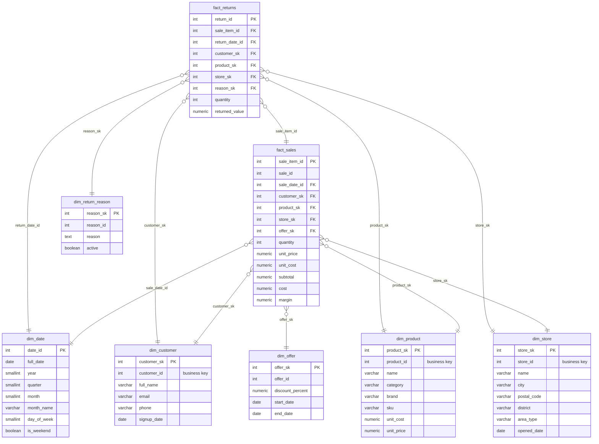

# Modelo dimensional — esquema `dwh` (estrella)

```mermaid
erDiagram
    fact_sales       }o--|| dim_date        : "sale_date_id"
    fact_sales       }o--|| dim_customer    : "customer_sk"
    fact_sales       }o--|| dim_product     : "product_sk"
    fact_sales       }o--|| dim_store       : "store_sk"
    fact_sales       }o--|| dim_offer       : "offer_sk"
    fact_returns     }o--|| fact_sales      : "sale_item_id"
    fact_returns     }o--|| dim_date        : "return_date_id"
    fact_returns     }o--|| dim_customer    : "customer_sk"
    fact_returns     }o--|| dim_product     : "product_sk"
    fact_returns     }o--|| dim_store       : "store_sk"
    fact_returns     }o--|| dim_return_reason : "reason_sk"

    dim_date {
        int    date_id PK
        date   full_date
        smallint year
        smallint quarter
        smallint month
        varchar  month_name
        smallint day_of_week
        boolean  is_weekend
    }
    dim_customer {
        int     customer_sk PK
        int     customer_id "business key"
        varchar full_name
        varchar email
        varchar phone
        date    signup_date
    }
    dim_product {
        int     product_sk PK
        int     product_id "business key"
        varchar name
        varchar category
        varchar brand
        varchar sku
        numeric unit_cost
        numeric unit_price
    }
    dim_store {
        int     store_sk PK
        int     store_id "business key"
        varchar name
        varchar city
        varchar postal_code
        varchar district
        varchar area_type
        date    opened_date
    }
    dim_offer {
        int     offer_sk PK
        int     offer_id
        numeric discount_percent
        date    start_date
        date    end_date
    }
    dim_return_reason {
        int     reason_sk PK
        int     reason_id
        text    reason
        boolean active
    }
    fact_sales {
        int     sale_item_id PK
        int     sale_id
        int     sale_date_id FK
        int     customer_sk  FK
        int     product_sk   FK
        int     store_sk     FK
        int     offer_sk     FK
        int     quantity
        numeric unit_price
        numeric unit_cost
        numeric subtotal
        numeric cost
        numeric margin
    }
    fact_returns {
        int     return_id PK
        int     sale_item_id  FK
        int     return_date_id FK
        int     customer_sk    FK
        int     product_sk     FK
        int     store_sk       FK
        int     reason_sk      FK
        int     quantity
        numeric returned_value
    }
```
