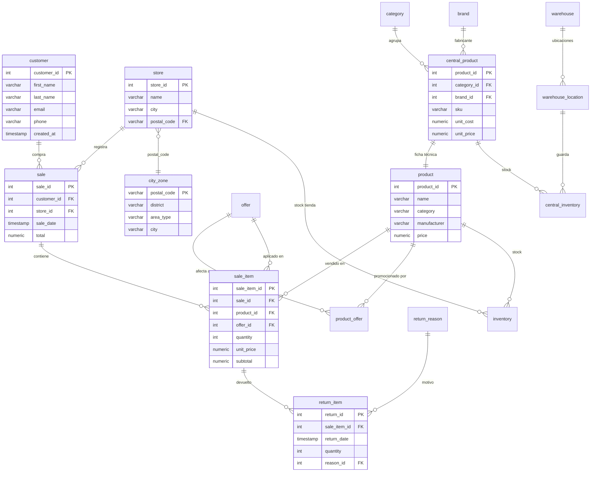

# Modelo Entidad–Relación — esquema `public`

```mermaid
erDiagram
    customer        ||--o{ sale          : "compra"
    store           ||--o{ sale          : "registra"
    sale            ||--o{ sale_item     : "contiene"
    product         ||--o{ sale_item     : "vendido en"
    central_product ||--|| product       : "ficha técnica"
    category        ||--o{ central_product : "agrupa"
    brand           ||--o{ central_product : "fabricante"
    offer           ||--o{ product_offer   : "afecta a"
    product         ||--o{ product_offer   : "promocionado por"
    offer           ||--o{ sale_item       : "aplicado en"
    sale_item       ||--o{ return_item     : "devuelto"
    return_reason   ||--o{ return_item     : "motivo"
    store           }o--|| city_zone       : "postal_code"
    warehouse       ||--o{ warehouse_location : "ubicaciones"
    warehouse_location ||--o{ central_inventory : "guarda"
    central_product    ||--o{ central_inventory : "stock"
    store              ||--o{ inventory          : "stock tienda"
    product            ||--o{ inventory          : "stock"

    customer {
        int customer_id PK
        varchar first_name
        varchar last_name
        varchar email
        varchar phone
        timestamp created_at
    }
    sale {
        int sale_id PK
        int customer_id FK
        int store_id FK
        timestamp sale_date
        numeric total
    }
    sale_item {
        int sale_item_id PK
        int sale_id FK
        int product_id FK
        int offer_id FK
        int quantity
        numeric unit_price
        numeric subtotal
    }
    return_item {
        int return_id PK
        int sale_item_id FK
        timestamp return_date
        int quantity
        int reason_id FK
    }
    product {
        int product_id PK
        varchar name
        varchar category
        varchar manufacturer
        numeric price
    }
    central_product {
        int product_id PK
        int category_id FK
        int brand_id FK
        varchar sku
        numeric unit_cost
        numeric unit_price
    }
    store {
        int store_id PK
        varchar name
        varchar city
        varchar postal_code FK
    }
    city_zone {
        varchar postal_code PK
        varchar district
        varchar area_type
        varchar city
    }
```
